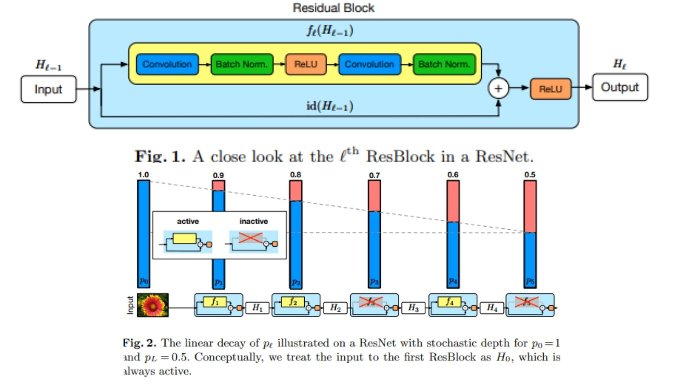

# ⚡ StochasticDepth-Replication PyTorch Implementation

This repository contains a PyTorch replication of **ResNet with Stochastic Depth** including both **basic residual blocks** (for CIFAR) and **bottleneck blocks** (for ImageNet) for flexible deep network training.

- Implemented full **ResNet architecture with stochastic depth**.  
- Supports **CIFAR and ImageNet configurations** with linear decay of block survival probabilities during training.  
- Architecture follows:  
**Conv → Residual/Bottleneck Stages → AvgPool → Flatten → FC**  
**Paper:** [Deep Networks with Stochastic Depth](https://arxiv.org/abs/1603.09382)

---

## 🖼 Overview – ResNet with Stochastic Depth

  

- **Figure 1:** A close-up of a single ResBlock in our ResNet with stochastic depth. Shows the internal flow: Convolution → Batch Normalization → ReLU → Convolution → Batch Normalization, plus the skip connection that either passes the input directly or projects it if dimensions differ. Highlights how stochastic depth may bypass this block during training.

- **Figure 2:** Illustration of the linear decay of survival probability across ResBlocks (from p0 = 1 to pL = 0.5). Conceptually, the input to the first ResBlock (H0) is always active. Later blocks have decreasing probability of being active, demonstrating how blocks may be skipped during training while the full network is used during testing.


- **General Model Idea:** Stochastic depth randomly drops blocks during training to reduce effective depth, improving gradient flow and speeding up training, but uses the full deep network during testing.

---

## 🏗 Project Structure

```bash
StochasticDepth-Replication/
│
├── src/
│   ├── layers/
│   │   ├── conv_layer.py            # BN → ReLU → Conv2d
│   │   ├── residual_block.py        # Normal residual block
│   │   ├── bottleneck_block.py      # Bottleneck residual block
│   │   ├── stochastic_depth.py      # Block drop logic
│   │   └── shortcut_layer.py        # Skip connection logic (identity/projection)
│   │
│   ├── blocks/
│   │   ├── basic_stage.py           # ResNet stage: several residual blocks
│   │   └── full_resnet_stage.py     # Full combination of stages
│   │
│   ├── model/
│   │   ├── resnet_cifar_sd.py       # CIFAR ResNet with stochastic depth
│   │   └── resnet_imagenet_sd.py    # ImageNet ResNet with stochastic depth
│   │
│   └── config.py                    # Channels, block counts, survival probabilities
│
├── requirements.txt
└── README.md
```
---

## 🔗 Feedback

For questions or feedback, contact: [barkin.adiguzel@gmail.com](mailto:barkin.adiguzel@gmail.com)
